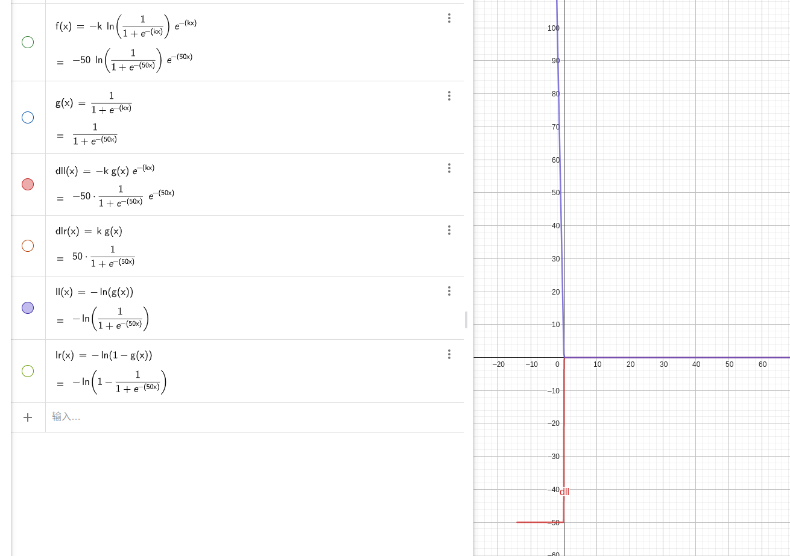

## 个人目标
实现对于国务院公告的文本检测。
输入：一张图片
输出：可以识别图片中的文字。


## 遇到的问题

### 测试了一下paddle ocr，默认的模型对于繁体字识别效果不好，出现错字漏字的情况。
需要做的事情，如何加入繁体字模型。


## paddle 学习分析

```
result = ocr.ocr(img_path, rec=False)# 识别出来的shape为(1,28,4,2) 1 是什么？我暂时理解不了，可能用于扩展文字，28应该是识别出来的28行的框，4应该是识别出来的定点个数，注意对于标准的文本，点的个数不一定是4个，
```

```
image = cv2.imread(img_path)
boxes = [line[0] for line in result]
print(len(result),len(result[0]),len(result[0][0]),len(result[0][0][0]))
print(result[0][0])
for box in result[0]:
    # box 是一个(4,2)结构二维数组
    box = np.reshape(np.array(box), [-1, 1, 2]).astype(np.int64) # 这里的reshape()把[1069.0, 1740.0]->[[1069.0, 1740.0]]
    
    image = cv2.polylines(np.array(image), [box], True, (255, 0, 0), 2)#可能是和polylines有关系
print(box,box.shape)

运行耗时: 893毫秒
1 28 4 2
[[1069.0, 1740.0], [1173.0, 1740.0], [1173.0, 1774.0], [1069.0, 1774.0]]
[[[126 178]]

 [[394 178]]

 [[394 206]]

 [[126 206]]] (4, 1, 2)
```

## DB 模型算法
可微二值化函数，解决了标准二值化不可求导的问题。

https://www.geogebra.org/graphing?lang=zh_CN 可以很好的研究函数变化。 
https://zhuanlan.zhihu.com/p/94677957 参考资料。

原论文，讲了参数k对于损失函数梯度的影响。
$$x=P_{{i,j}}-T_{{i,j}}$$ 
对于正向损失函数x<0时，梯度是一个较大的负数。
$P_{{i,j}}$是预测为正样本的概率,$T_{{i,j}}$ 是阈值，
x<0表示实际预测的是一个负样本。
x>0表示实际预测的是一个正样本。
此时损失函数的梯度肯定是有意义的，我目前不理解的是梯度的正负号对于损失函数的值减少是否有用？如何作用的,见下图

图像表示，当x<0时，且标签值为正时，损失函数非常的大，且梯度绝对值较大，可以较快的收敛。

如何研究这个论文，需要看一下fpn网络。
https://www.bilibili.com/video/BV1dh411U7D9/?spm_id_from=333.337.search-card.all.click&vd_source=1f395a37cd5c9bc7da751b392b2a6adc


目前看还需要再补一下  FPN网络，目前大概知道了，FPN网络的结构，有什么好处呢？
https://github.com/jwyang/fpn.pytorch/blob/23bd1d2fa09fbb9453f11625d758a61b9d600942/lib/model/fpn/fpn.py#L45 这个可以看懂网络结果，但是没有网络怎么构造的，不清楚。
```
        # feed image data to base model to obtain base feature map
        # Bottom-up
        c1 = self.RCNN_layer0(im_data)
        c2 = self.RCNN_layer1(c1)
        c3 = self.RCNN_layer2(c2)
        c4 = self.RCNN_layer3(c3)
        c5 = self.RCNN_layer4(c4)
        # Top-down
        p5 = self.RCNN_toplayer(c5)
        p4 = self._upsample_add(p5, self.RCNN_latlayer1(c4))
        p4 = self.RCNN_smooth1(p4)
        p3 = self._upsample_add(p4, self.RCNN_latlayer2(c3))
        p3 = self.RCNN_smooth2(p3)
        p2 = self._upsample_add(p3, self.RCNN_latlayer3(c2))
        p2 = self.RCNN_smooth3(p2)

        p6 = self.maxpool2d(p5)

        rpn_feature_maps = [p2, p3, p4, p5, p6]
        mrcnn_feature_maps = [p2, p3, p4, p5]
```
还需要再看一下rsnet残差网络，看一个代码如何实现的。

DEformable convolution .


https://zhuanlan.zhihu.com/p/94677957

## 需要学习的东西
FPN 
Deformable Conv
resnet
Transpose 转置卷积
